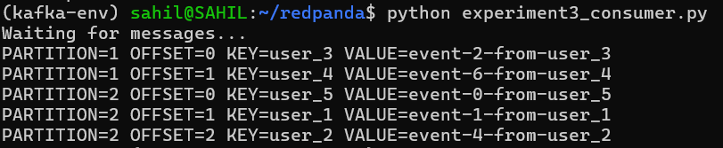
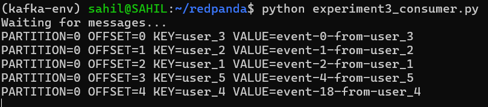

# Experiments

## Experiment 1: Impact of Message Size Limits in Redpanda (Producer + Broker)

### Step 1: Build Redpanda

```bash
bazel build //src/v/redpanda:redpanda \
  --config=release \
  --jobs=2 \
  --local_resources=memory=4096 \
  --define=use_system_liburing=true \
  --action_env=LIBURING_USE_SYSTEM=1 \
  --spawn_strategy=standalone
```

**What it does:**
- Converts C++ source code → executable binary
- Applies your source code changes
- Produces final file: `bazel-bin/src/v/redpanda/redpanda`

---

### Step 2: Start the Redpanda Server

```bash
./bazel-bin/src/v/redpanda/redpanda \
  --redpanda-cfg redpanda.yaml \
  --smp=1 \
  --memory=1G \
  --reserve-memory=0M
```

> **NOTE:** After running, leave this terminal open.

**What it does:**
- Starts Redpanda server
- Opens Kafka API (port 9092)
- Ready to send/receive messages

---

### Step 3: Create Python Test File (Before Changes)

Create file: `nano experiment_before.py`

```python
from kafka import KafkaProducer, KafkaConsumer
import uuid, time, json

TOPIC = "batch-exp"
BROKER = "localhost:9092"
N = 20

def run_test(msg_size_kb):
    run_id = str(uuid.uuid4())
    print(f"\n=== TEST: {msg_size_kb} KB MESSAGE ===")

    payload = {
        "run_id": run_id,
        "data": "A" * (msg_size_kb * 1024)
    }

    # 🔴 STRICT PRODUCER (default limit)
    producer = KafkaProducer(
        bootstrap_servers=BROKER,
        value_serializer=lambda v: json.dumps(v).encode(),
        acks=1,
        request_timeout_ms=20000
    )

    sent = 0
    for _ in range(N):
        producer.send(TOPIC, payload)
        sent += 1

    producer.flush()
    producer.close()

    consumer = KafkaConsumer(
        TOPIC,
        bootstrap_servers=BROKER,
        group_id=str(uuid.uuid4()),
        auto_offset_reset="earliest",
        value_deserializer=lambda v: v,
        consumer_timeout_ms=5000
    )

    received = 0
    for msg in consumer:
        try:
            data = json.loads(msg.value.decode())
            if data.get("run_id") == run_id:
                received += 1
        except:
            continue

    consumer.close()

    print(f"Sent: {sent}")
    print(f"Received: {received}")
    print(f"Missing: {sent - received}")


run_test(512)
time.sleep(2)
run_test(1100)
```

---

### Step 4: Run and Note Output

```bash
python experiment_before.py
```

> Note down the output, then press `Ctrl+C` in the Step 2 terminal.

---

### Step 5: Modify Source Code

**File:** `redpanda/src/v/kafka/server/handlers/produce.cc`

**Find:**
```cpp
auto batch_size = req.batch->size_bytes();
if (static_cast<uint32_t>(batch_size) > req.batch_max_bytes)
```

**Replace with:**
```cpp
auto batch_size = req.batch->size_bytes();

// 🔴 custom limit (experiment)
uint32_t custom_max_batch_bytes = req.batch_max_bytes * 5;

if (static_cast<uint32_t>(batch_size) > custom_max_batch_bytes) {
    auto msg = ssx::sformat(
      "batch size {} exceeds custom max {}",
      batch_size,
      custom_max_batch_bytes);

    thread_local static ss::logger::rate_limit rate(1s);
    vloglr(klog, ss::log_level::warn, rate, "{}", msg);

    co_return finalize_request_with_error_code(
      error_code::message_too_large,
      std::move(dispatched),
      req.ntp,
      ss::this_shard_id(),
      std::move(msg));
}
```

---

### Step 6: Rebuild Redpanda

```bash
bazel build //src/v/redpanda:redpanda \
  --config=release \
  --jobs=2 \
  --local_resources=memory=4096 \
  --define=use_system_liburing=true \
  --action_env=LIBURING_USE_SYSTEM=1 \
  --spawn_strategy=standalone
```

---

### Step 7: Restart the Server

```bash
./bazel-bin/src/v/redpanda/redpanda \
  --redpanda-cfg redpanda.yaml \
  --smp=1 \
  --memory=1G \
  --reserve-memory=0M
```

> **NOTE:** Leave this terminal open.

---

### Step 8: Create Python Test File (After Changes)

Create file: `nano experiment_after.py`

```python
from kafka import KafkaProducer, KafkaConsumer
import uuid, time, json

TOPIC = "batch-exp"
BROKER = "localhost:9092"
N = 20

def run_test(msg_size_kb):
    run_id = str(uuid.uuid4())
    print(f"\n=== TEST: {msg_size_kb} KB MESSAGE ===")

    payload = {
        "run_id": run_id,
        "data": "A" * (msg_size_kb * 1024)
    }

    # 🟢 RELAXED PRODUCER (allow large messages)
    producer = KafkaProducer(
        bootstrap_servers=BROKER,
        value_serializer=lambda v: json.dumps(v).encode(),
        acks=1,
        request_timeout_ms=20000,
        max_request_size=5 * 1024 * 1024,
        buffer_memory=10 * 1024 * 1024
    )

    sent = 0
    for _ in range(N):
        producer.send(TOPIC, payload)
        sent += 1

    producer.flush()
    producer.close()

    consumer = KafkaConsumer(
        TOPIC,
        bootstrap_servers=BROKER,
        group_id=str(uuid.uuid4()),
        auto_offset_reset="earliest",
        value_deserializer=lambda v: v,
        consumer_timeout_ms=5000
    )

    received = 0
    for msg in consumer:
        try:
            data = json.loads(msg.value.decode())
            if data.get("run_id") == run_id:
                received += 1
        except:
            continue

    consumer.close()

    print(f"Sent: {sent}")
    print(f"Received: {received}")
    print(f"Missing: {sent - received}")


run_test(512)
time.sleep(2)
run_test(1100)
```

---

### Step 9: Run and Compare

```bash
python experiment_after.py
```

> Note down the output and compare with the before results.


---

## Experiment 2: Duplicate Message Detection in Redpanda

### Step 1: Start Redpanda Server

```bash
./bazel-bin/src/v/redpanda/redpanda \
  --redpanda-cfg redpanda.yaml \
  --smp=1 \
  --memory=1G \
  --reserve-memory=0M
```

> Leave this terminal open.

---

### Step 2: Create Consumer Script

Create file: `nano experiment2.py`

```python
from kafka import KafkaProducer
import json
import time

producer = KafkaProducer(
    bootstrap_servers=['localhost:9092'],
    value_serializer=lambda v: json.dumps(v).encode('utf-8')
)

topic = 'test_duplicates'

print("Sending messages with duplicate keys...")
messages = [
    ('id_1', {'msg': 'First message with id_1', 'timestamp': 1}),
    ('id_2', {'msg': 'First message with id_2', 'timestamp': 2}),
    ('id_1', {'msg': 'DUPLICATE id_1', 'timestamp': 3}),
    ('id_3', {'msg': 'First message with id_3', 'timestamp': 4}),
    ('id_2', {'msg': 'DUPLICATE id_2', 'timestamp': 5}),
    ('id_1', {'msg': 'DUPLICATE id_1 again', 'timestamp': 6}),
    ('id_4', {'msg': 'First message with id_4', 'timestamp': 7}),
]

for key, value in messages:
    future = producer.send(topic, key=key.encode('utf-8'), value=value)
    result = future.get(timeout=10)
    print(f"Sent: key={key}, value={value['msg']}")
    time.sleep(0.1)

producer.close()
print("\n✅ All messages sent")
```

---

### Step 3: Run and Note Output

```bash
python experiment2.py
```

> Note down the output and check logs from Step 1. Then press `Ctrl+C` in the Step 1 terminal.

---

### Step 4: Modify Source Code for Duplicate Detection

**File:** `redpanda/src/v/kafka/server/handlers/produce.cc`

Find this line:
```cpp
auto batch_size = req.batch->size_bytes();
```

Add the following block **below** that line:

```cpp
// ==================== DUPLICATE DETECTION START ===========
static thread_local std::unordered_set<ss::sstring> seen_keys;

// Extract key from batch records
for (const auto& record : req.batch->copy_records()) {
    if (record.has_key()) {
        auto key_view = record.key();
        ss::sstring key_str(key_view.data(), key_view.size());

        // Check if key already seen
        if (seen_keys.contains(key_str)) {
            vlog(klog.info,
                 "🚫 DUPLICATE SKIPPED: ntp={} key='{}' - message rejected",
                 req.ntp, key_str);

            co_return finalize_request_with_error_code(
                error_code::none,  // Return success to avoid client errors
                std::move(dispatched),
                req.ntp,
                ss::this_shard_id());
        }

        // Store new key
        seen_keys.insert(key_str);
        vlog(klog.info,
             "✅ NEW KEY ACCEPTED: ntp={} key='{}' - message will be stored",
             req.ntp, key_str);
    }
}
// ==================== DUPLICATE DETECTION END ================
```

---

### Step 5: Rebuild Redpanda

```bash
bazel build //src/v/redpanda:redpanda \
  --config=release \
  --jobs=2 \
  --local_resources=memory=4096 \
  --define=use_system_liburing=true \
  --action_env=LIBURING_USE_SYSTEM=1 \
  --spawn_strategy=standalone
```

---

### Step 6: Restart Server

```bash
./bazel-bin/src/v/redpanda/redpanda \
  --redpanda-cfg redpanda.yaml \
  --smp=1 \
  --memory=1G \
  --reserve-memory=0M
```

---

### Step 7: Rerun Consumer Script

```bash
python experiment2.py
```

---

### Step 8: Check Logs

- Check how many duplicates were detected
- Check which keys were flagged as duplicates

---

### Step 9: Results


# Experiment 3 — Hot Partition Problem

### Modifying Redpanda Source Code to Reproduce Real-World Streaming Bottlenecks

---

## Overview

This experiment walks through how the **Hot Partition Problem** was reproduced by modifying the Redpanda broker's internal partition routing logic. The steps cover setup, source-code modification, rebuild, and observation of both baseline and modified behavior.

---

## Step 1 — Start Redpanda Server

Run the Redpanda broker:

```bash
./bazel-bin/src/v/redpanda/redpanda \
  --redpanda-cfg redpanda.yaml \
  --smp=1 \
  --memory=1G \
  --reserve-memory=0M
```

---

## Step 2 — Create Topic

Create a topic with 3 partitions:

```bash
rpk topic create hot-topic -p 3
```

---

## Step 3 — Producer Script

Create `experiment3_producer.py`:

```python
from confluent_kafka import Producer
import random
import time

conf = {'bootstrap.servers': 'localhost:9092'}
producer = Producer(conf)
topic = "hot-topic"

users = ["user_1", "user_2", "user_3", "user_4", "user_5"]

for i in range(100):
    user = random.choice(users)
    value = f"event-{i}-from-{user}"
    producer.produce(topic, key=user.encode(), value=value.encode())
    print(f"Produced: {value}")
    time.sleep(0.1)

producer.flush()
print("DONE")
```

---

## Step 4 — Consumer Script

Create `experiment3_consumer.py`:

```python
from confluent_kafka import Consumer

conf = {
    'bootstrap.servers': 'localhost:9092',
    'group.id': 'hot-group',
    'auto.offset.reset': 'earliest'
}

consumer = Consumer(conf)
consumer.subscribe(["hot-topic"])
print("Waiting for messages...")

while True:
    msg = consumer.poll(1.0)
    if msg is None:
        continue
    if msg.error():
        print("ERROR:", msg.error())
        continue
    print(
        f"PARTITION={msg.partition()} "
        f"OFFSET={msg.offset()} "
        f"KEY={msg.key().decode()} "
        f"VALUE={msg.value().decode()}"
    )
```

---

## Step 5 — Baseline Run

**Terminal 1:**
```bash
python experiment3_consumer.py
```

**Terminal 2:**
```bash
python experiment3_producer.py
```

---

## Baseline Observation

**Producer output:**

```
Produced: event-0-from-user_5
Produced: event-1-from-user_1
Produced: event-2-from-user_3
...
DONE
```

**Consumer output:**

```
PARTITION=1 OFFSET=0 KEY=user_3 VALUE=event-2-from-user_3
PARTITION=1 OFFSET=1 KEY=user_4 VALUE=event-6-from-user_4
PARTITION=2 OFFSET=0 KEY=user_5 VALUE=event-0-from-user_5
PARTITION=2 OFFSET=1 KEY=user_1 VALUE=event-1-from-user_1
PARTITION=2 OFFSET=2 KEY=user_2 VALUE=event-4-from-user_2
```

Traffic is **balanced** — different keys distributed across different partitions. This is default Kafka hash partitioning working correctly.



---
  
## Step 6 — Modify Redpanda Source Code

Open the following file:

```bash
src/v/kafka/server/handlers/produce.cc
```

Locate the existing partition assignment code:

```cpp
auto ntp = model::ntp(
    model::kafka_namespace,
    topic.name,
    part.partition_index);
```

Comment out the original code:

```cpp
// auto ntp = model::ntp(
//     model::kafka_namespace,
//     topic.name,
//     part.partition_index);
```

Now add the following dynamic partition routing logic below it:

```cpp
// ----------------------------------------------------
// Dynamic Partition Routing Logic
// ----------------------------------------------------

static thread_local int message_counter = 0;

message_counter++;

model::partition_id dynamic_partition(0);

// Route messages dynamically based on count
if (message_counter > 50 && message_counter <= 100) {
    dynamic_partition = model::partition_id(1);
} else if (message_counter > 100) {
    dynamic_partition = model::partition_id(2);
}

// Create NTP using dynamically selected partition
auto ntp = model::ntp(
    model::kafka_namespace,
    topic.name,
    dynamic_partition);

// Debug logging
vlog(
    klog.warn,
    "🔥 DYNAMIC PARTITION ROUTING "
    "message={} original={} routed={}",
    message_counter,
    part.partition_index,
    dynamic_partition);
```
  

---

## Step 7 — Rebuild Redpanda

```bash
bazel build //src/v/redpanda:redpanda \
  --config=release \
  --jobs=2 \
  --local_resources=memory=4096 \
  --define=use_system_liburing=true \
  --action_env=LIBURING_USE_SYSTEM=1 \
  --spawn_strategy=standalone
```

---

## Step 8 — Restart Redpanda Server

```bash
./bazel-bin/src/v/redpanda/redpanda \
  --redpanda-cfg redpanda.yaml \
  --smp=1 \
  --memory=1G \
  --reserve-memory=0M
```

---

## Step 9 — Run Same Scripts Again

**Terminal 1:**
```bash
python experiment3_consumer.py
```

**Terminal 2:**
```bash
python experiment3_producer.py
```

---

## After Modification Observation

**Producer output:**

```
Produced: event-0-from-user_3
Produced: event-1-from-user_2
Produced: event-2-from-user_1
...
DONE
```

**Consumer output:**

```
PARTITION=0 OFFSET=0 KEY=user_3 VALUE=event-0-from-user_3
PARTITION=0 OFFSET=1 KEY=user_2 VALUE=event-1-from-user_2
PARTITION=0 OFFSET=2 KEY=user_1 VALUE=event-2-from-user_1
PARTITION=0 OFFSET=3 KEY=user_5 VALUE=event-4-from-user_5
PARTITION=0 OFFSET=4 KEY=user_4 VALUE=event-18-from-user_4
```

All traffic now routes to **partition 0** — the hot partition is created.



---


The experiment successfully reproduced the **Hot Partition Problem** — a real-world bottleneck observed in production systems at Uber, Netflix, Swiggy, Twitter, and IPL live streaming platforms.